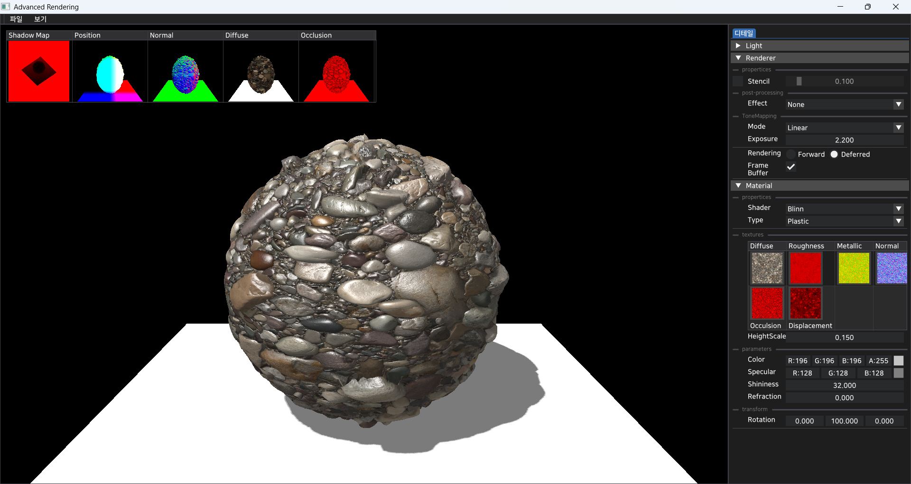

# AdvancedRendering
**Lighting, Shadow, PBR, IBL** 학습.

## 주요 특징
- **OpenGL 기반 렌더링 파이프라인 구현**
- **Deferred Rendering 구조**
- **컴포넌트 기반 엔진 아키텍처**
    Renderer, Actor, Component 단위로 모듈화된 엔진 구조 설계
- **Shader & Material 시스템**
    GLSL 셰이더 파이프라인 구축 및 머티리얼 파라미터 설정
- **Resource Manager**
    메시, 텍스처, 셰이더, 머티리얼 등 렌더링에 필요한 리소스 생성 및 관리

## 사용 라이브러리
- **GLFW** : OpenGL 컨텍스트 및 윈도우 관리, 입력 처리
- **stb_image** : 이미지(Texture) 파일 로딩
- **Dear ImGui** : UI 시스템 구축

## 참고 사이트
- **https://learnopengl.com/**
- **https://media.korea.ac.kr/books/**
- **https://lifeisforu.tistory.com/category/PBR%28Physically%20Based%20Rendering%29**

## 🖼️ 샘플 렌더 결과

